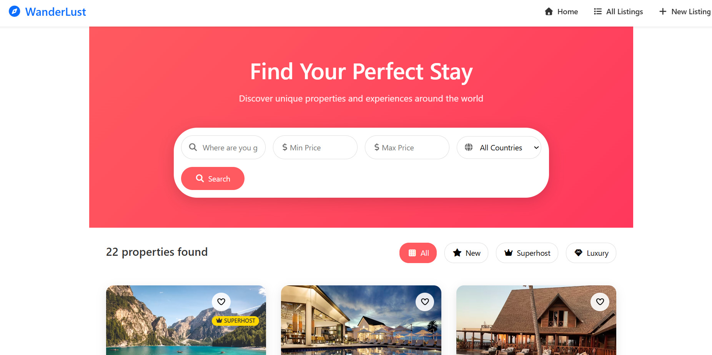
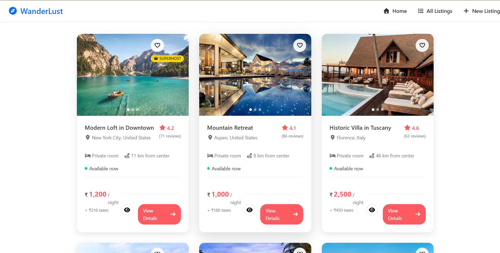
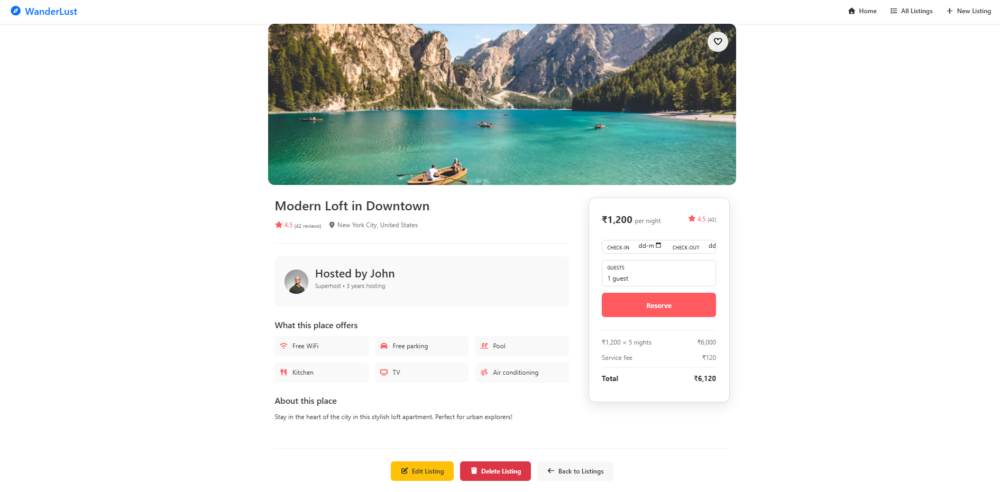
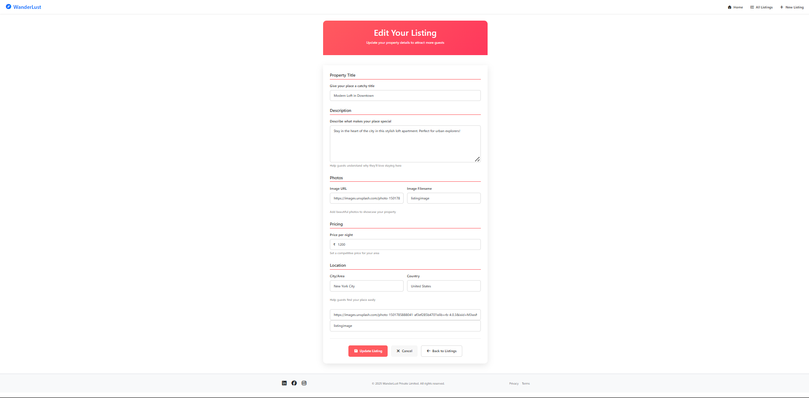
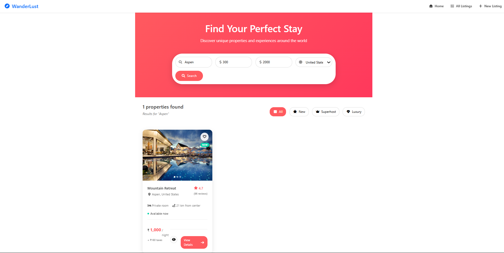

# 🧭 Wanderlust – Airbnb-Style Listings App (Node.js + EJS)

A simple Airbnb-style app built with Node.js, Express, and MongoDB. Includes full CRUD functionality, RESTful routing, EJS templating, and basic styling. Features dynamic pages for creating, editing, viewing, and deleting listings. Includes sample data and organized folder structure for learning purposes.

Wanderlust is a full-stack web application inspired by Airbnb.  
Users can browse, create, edit, and delete listings of places to stay. Built with **Express.js**, **EJS templating**, and **MongoDB (optional)** using the MVC pattern.

---

## 📸 Screenshots

Here are some UI highlights from Wanderlust:

### 🏠 Home Page with Search + Navbar

### 🏨 Listings on Home Page

### 📄 Listing Details View

### ✏️ Edit Listing Page

### 🔍 Search Filter Results

---

## 🛠 Tech Stack

- **Backend:** Node.js, Express.js
- **Templating Engine:** EJS
- **Frontend:** HTML, CSS (custom)
- **Database:** MongoDB (optional or coming soon)
- **Layout Engine:** MVC (Models, Views, Controllers)

---

## ✨ Features

- 🏠 Browse all listings
- ➕ Create new listings
- ✏️ Edit existing listings
- ❌ Delete listings
- 🌐 Layout using EJS partials and boilerplates
- 🎨 Custom CSS styling
- 📁 Organized folder structure (MVC)

---

## 📁 Project Structure

